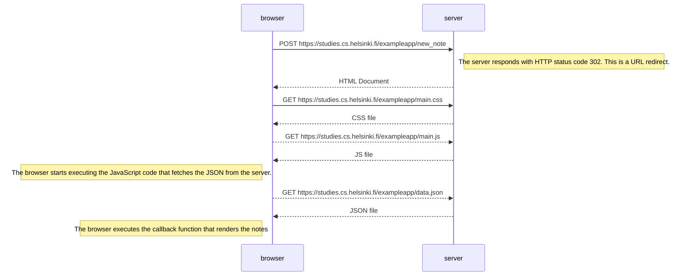

```mermaid
sequenceDiagram
    participant browser
    participant server

browser->>server: POST https://studies.cs.helsinki.fi/exampleapp/new_note

note right of  server: The server responds with HTTP status code 302. This is a URL redirect.
server-->>browser: HTML Document


browser->>server: GET https://studies.cs.helsinki.fi/exampleapp/main.css

server-->>browser: CSS file


browser-->>server:GET https://studies.cs.helsinki.fi/exampleapp/main.js

server-->>browser: JS file

Note left of browser: The browser starts executing the JavaScript code that fetches the JSON from the server.

browser-->>server:GET https://studies.cs.helsinki.fi/exampleapp/data.json

server-->>browser: JSON file

Note left of browser: The browser executes the callback function that renders the notes
```