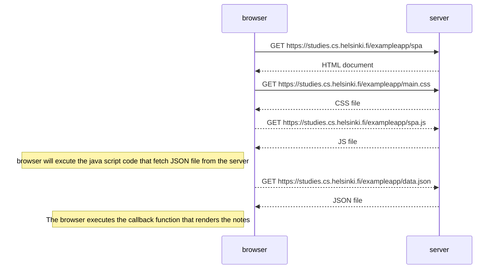

```mermaid
sequenceDiagram
    participant browser
    participant server

browser->>server: GET https://studies.cs.helsinki.fi/exampleapp/spa 
server-->>browser: HTML document

browser->>server: GET https://studies.cs.helsinki.fi/exampleapp/main.css
server-->>browser: CSS file

browser-->>server: GET https://studies.cs.helsinki.fi/exampleapp/spa.js
server-->>browser: JS file

note left of browser : browser will excute the java script code that fetch JSON file from the server

browser-->>server: GET https://studies.cs.helsinki.fi/exampleapp/data.json
server-->>browser: JSON file

Note left of browser: The browser executes the callback function that renders the notes
```